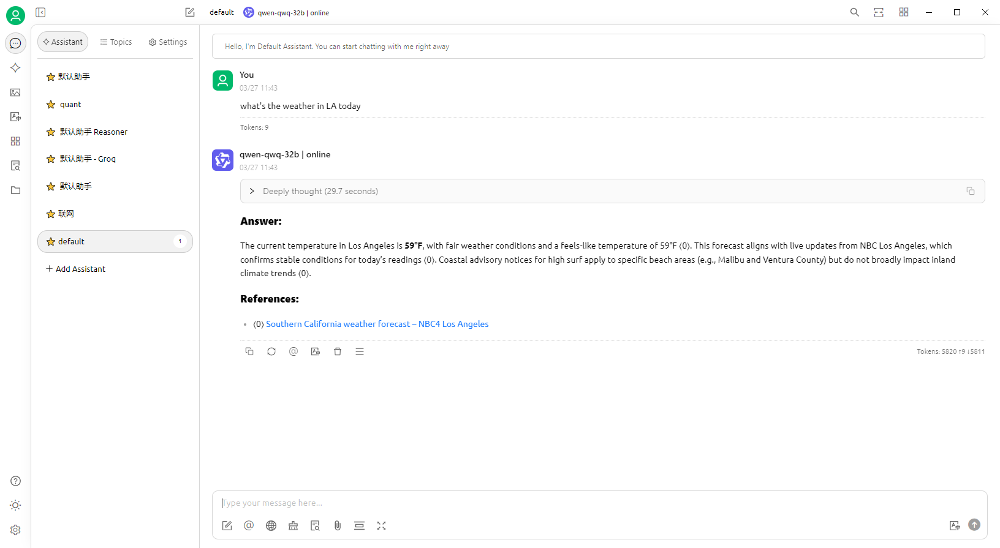

# LLMSearch - LLM Intelligent Search Enhancement

[](https://opensource.org/licenses/MIT)
[](https://www.python.org/downloads/)
[](README.zh_CN.md)

A Haystack-based intelligent search enhanced language model system with real-time web search capabilities.

## Key Features

- 🔍 Real-time web search integration (Google/Serper/Bing supported)
- 🤖 Multi-LLM support (OpenAI, Anthropic, local models)
- 🧩 Modular design for easy extension
- ⚡ Streaming response support
- 🔌 Compatible with various openai frontends (like cherry studio, Chatbox, AnythingLLM)
- 📊 Intelligent search result ranking & filtering
- 🌐 Support multiple languages (Chinese/English)
## DEMO



## Quick Start

### Installation
```bash
git clone https://github.com/yourusername/llmsearch.git
cd llmsearch
pip install -r requirements.txt
```

### Environment Setup
1. Create a .env file in the current directory and input the following configuration
``` env
LANG=en
HOST=127.0.0.1
PORT=8001
GROQ_API_KEY=your-groq-api-key
OPENAI_API_BASE_URL=your-openai-api-base-url
MODEL=your-model
SEARXNG_URL=your-searxng-url
USE_SILICONFLOW_EMBEDDER=false
```
2. export environment variables
```bash
export LANG=en
export HOST=127.0.0.1
export PORT=8001
export GROQ_API_KEY=your-groq-api-key
export OPENAI_API_BASE_URL=your-openai-api-base-url
export MODEL=your-model
export SEARXNG_URL=your-searxng-url
export USE_SILICONFLOW_EMBEDDER=false
```
USE_SILICONFLOW_EMBEDDER is optional, It's used to switch embedding model from local to remote siliconflow platform.

### Basic Usage
``` bash
python api_server.py
```

## License

This project is licensed under the [MIT License](LICENSE)