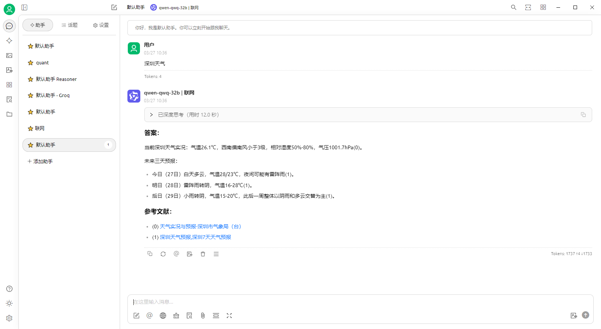

# LLMSearch - LLM智能搜索增强

[](https://opensource.org/licenses/MIT)
[](https://www.python.org/downloads/)
[](README.en.md)

基于Haystack框架构建的智能搜索增强语言模型系统，结合最新大语言模型与实时网络搜索能力。

## 主要特性

- 🔍 实时网络搜索集成（支持Google/Serper/Bing等）
- 🤖 多LLM支持（OpenAI/Groq/SiliconFlow等）
- 🧩 模块化设计，易于扩展
- ⚡ 支持流式响应
- 🔌 兼容各大openai前端（如cherry studio、Chatbox、AnythingLLM）
- 📊 搜索结果智能排序与过滤
- 🌐 支持多语言（中文/英文）

## DEMO



## 快速开始

### 安装依赖
```bash
git clone https://github.com/yourusername/llmsearch.git
cd llmsearch
pip install -r requirements.txt
```

### 环境配置
1. 创建一个.env文件到当前目录并输入以下配置
``` env
LANG=zh_CN
HOST=127.0.0.1
PORT=8001
SILICONFLOW_API_KEY=your-siliconflow-api-key
GROQ_API_KEY=your-groq-api-key
OPENAI_API_BASE_URL=your-openai-api-base-url
MODEL=your-model
SEARXNG_URL=your-searxng-url
USE_SILICONFLOW_EMBEDDER=true
```
2. export 环境变量
```bash
export LANG=zh_CN
export HOST=127.0.0.1
export PORT=8001
export SILICONFLOW_API_KEY=your-siliconflow-api-key
export GROQ_API_KEY=your-groq-api-key
export OPENAI_API_BASE_URL=your-openai-api-base-url
export MODEL=your-model
export SEARXNG_URL=your-searxng-url
export USE_SILICONFLOW_EMBEDDER=true
```
USE_SILICONFLOW_EMBEDDER 是可选的，用于切换嵌入模型从本地到远程硅基流动平台。

### 基础使用
``` bash
python api_server.py
```

## 许可证

本项目采用 [MIT License](LICENSE)
