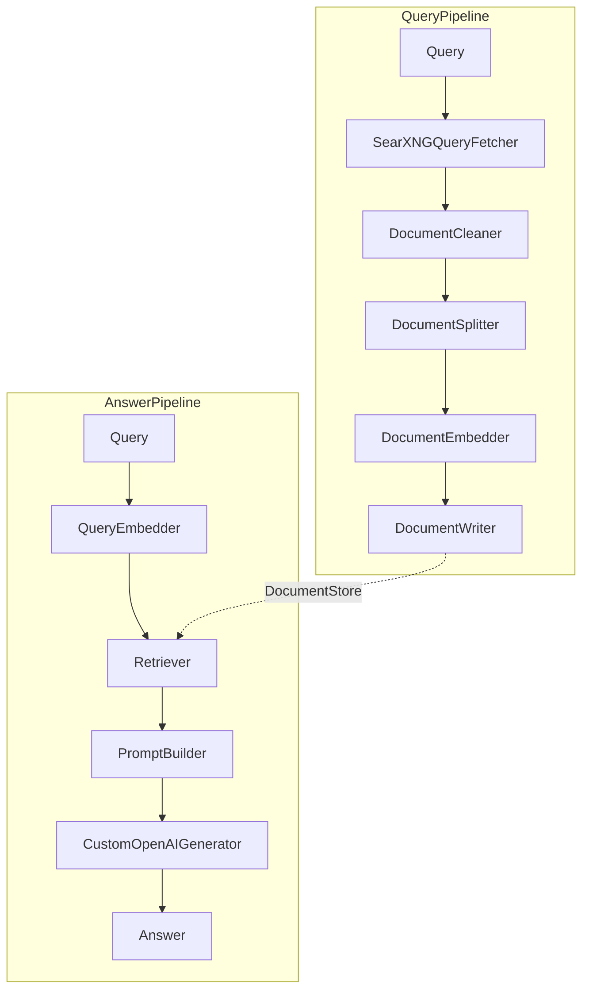

# LLMSearch 实现解析

[llmsearch项目地址：](https://github.com/ZenWayne/llmsearch)
## 系统架构概览
本系统基于Haystack 2.0构建，采用模块化管道设计，主要包含以下核心组件：

## 主要组件

### RAG系统
```python
rag_system = RAGSystem(
    split_lines=10,
    searxng_url="http://127.0.0.1:8080/",
    result_per_query=5
)
```

## 自定义核心组件

| 组件名称               | 功能描述                                                                 |
|------------------------|--------------------------------------------------------------------------|
| SearxngQueryFetcher    | 根据查询类型自动选择搜索引擎（学术搜索/常规搜索/实时搜索）               |
| SiliconFlowDocumentEmberdder      | 使用硅基流动平台的embedder进行文档的embeding                      |
| SiliconFlowTextEmbedder     | 使用硅基流动平台的embedder进行文本的embeding                                       |
| PromptBuilder | 根据多个文档的分片，整理成提示词               |
| CustomOpenAIGenerator | 使用OpenAI的模型生成回答，兼容OpenAI API格式（streaming_callback）               |

## 管道工作流程

流程图


该架构支持灵活扩展，可通过添加新组件实现功能增强，同时保持核心流程的稳定性。